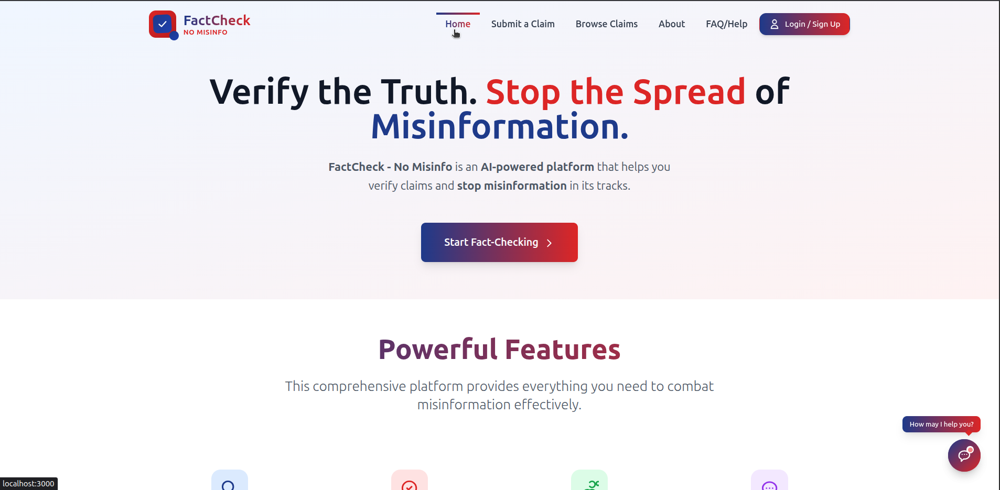
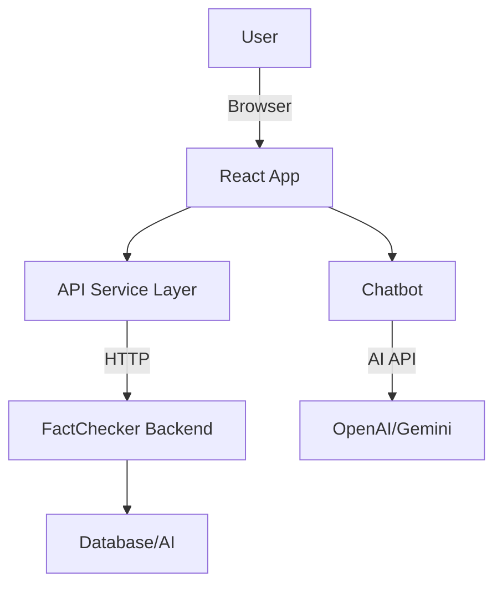

# 🕵️‍♂️ FactChecker Frontend

[](https://react.dev/)
[](https://tailwindcss.com/)
[](../LICENSE)

> A modern, interactive web interface for the FactChecker platform. Verify claims, browse fact-checks, and interact with AI-powered tools in real time.

---

## 📋 Table of Contents
- [Features](#features)
- [Screenshots](#screenshots)
- [Project Structure](#project-structure)
- [Technology Stack](#technology-stack)
- [Architecture](#architecture)
- [Setup & Installation](#setup--installation)
- [Environment Variables](#environment-variables)
- [Usage](#usage)
- [API Integration](#api-integration)
- [Testing](#testing)
- [Linting & Formatting](#linting--formatting)
- [Deployment](#deployment)
- [Contributing](#contributing)
- [License](#license)
- [Acknowledgments](#acknowledgments)
- [Contact & Support](#contact--support)

---

## ✨ Features
- 🔍 Submit claims for instant fact-checking
- 🧠 AI-powered chatbot (Gemini/OpenAI integration)
- 📊 Trust score and evidence display
- 🗂️ Browse and search public claims
- 👤 User authentication (login/logout)
- 🛡️ Privacy, Terms, and Community Guidelines
- 📱 Responsive design (mobile & desktop)
- 🧩 Modular React components
- 🎨 TailwindCSS for rapid UI development

---

## 🖼️ Screenshots

---

## 📁 Project Structure

```
frontend/
├── public/                  # Static assets
├── src/
│   ├── components/          # React UI components (pages, modals, chatbot, etc.)
│   ├── hooks/               # Custom React hooks
│   ├── services/            # API and backend integration
│   ├── App.js               # Main app component
│   ├── index.js             # Entry point
│   ├── App.css, index.css   # Styles
│   └── ...
├── package.json             # Project metadata & scripts
├── tailwind.config.js       # TailwindCSS config
├── postcss.config.js        # PostCSS config
└── README.md                # This file
```

### Key Files
- **`src/components/`**: All major UI and page components (e.g., `SubmitClaimPage.js`, `ProfilePage.js`, `ChatbotWindow.js`)
- **`src/services/api.js`**: Handles API requests to the backend
- **`src/hooks/`**: Custom React hooks for state and logic
- **`App.js`**: Main application logic and routing

---

## 🛠️ Technology Stack
- **React 19** – UI library
- **React Router** – Routing
- **TailwindCSS** – Utility-first CSS
- **OpenAI & Google Generative AI SDKs** – Chatbot/AI features
- **Jest & React Testing Library** – Testing
- **Lucide-react** – Icon library
- **ESLint, Prettier** – Linting & formatting

---

## 🏗️ Architecture



- **Component-based**: Each page/feature is a React component
- **Service layer**: All backend/API calls are centralized
- **State management**: Via React hooks/context
- **Styling**: TailwindCSS utility classes

---

## ⚡ Setup & Installation

### Prerequisites
- Node.js (v18+ recommended)
- npm (v9+ recommended)

### Local Development
```bash
# Clone the repo
cd frontend
npm install
npm start
```
- App runs at [http://localhost:3000](http://localhost:3000)
- Backend should be running at [http://localhost:5000](http://localhost:5000) (see proxy in `package.json`)

### Production Build
```bash
npm run build
```
- Outputs static files to `build/`

---

## 🔑 Environment Variables
Create a `.env` file in the root:
```
REACT_APP_API_URL=http://localhost:5000
REACT_APP_OPENAI_KEY=your_openai_key
REACT_APP_GEMINI_KEY=your_gemini_key
```
- _Never commit real secrets to source control!_

---

## 🚀 Usage
- Visit `/` to submit a claim
- Use the chatbot for AI-powered Q&A
- Browse `/claims` for public fact-checks
- View your profile and history
- Access privacy, terms, and FAQ from the footer

---

## 🔗 API Integration
- All API calls are handled in `src/services/api.js`
- Uses `fetch` or `axios` (depending on your implementation)
- Handles authentication tokens and error states
- Example:
  ```js
  import { verifyClaim } from './services/api';
  verifyClaim({ claim: 'The sky is blue.' })
    .then(res => console.log(res));
  ```

---

## 🧪 Testing
```bash
npm test
```
- Uses Jest and React Testing Library
- Test files: `*.test.js`

---

## 🧹 Linting & Formatting
```bash
npm run lint
npm run format
```
- ESLint and Prettier are recommended (add config if not present)

---

## 🚢 Deployment
- **Vercel/Netlify**: Connect repo, set environment variables, deploy
- **Docker**: (Optional) Add a `Dockerfile` for containerized deployment
- **Static Hosting**: Upload `build/` to S3, Firebase, etc.

---

## 🤝 Contributing
1. Fork the repo
2. Create a feature branch (`git checkout -b feature/your-feature`)
3. Commit and push your changes
4. Open a Pull Request

---

## 📄 License
MIT – see [LICENSE](../LICENSE)

---

## 🙏 Acknowledgments
- [React](https://react.dev/)
- [TailwindCSS](https://tailwindcss.com/)
- [OpenAI](https://openai.com/)
- [Google Generative AI](https://ai.google/)

---

## 📬 Contact & Support
- Open an issue or discussion in this repo
- Email: support@factchecker.com
